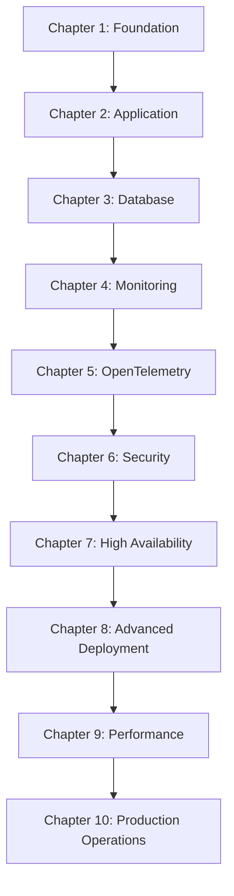

# NuxtOps V3 Chapter-Based Implementation Guide

This directory contains progressive implementation scripts organized by chapters, following the "Engineering Elixir Applications" approach for systematic deployment and infrastructure management.

## Overview

The chapter-based approach breaks down the complete NuxtOps V3 deployment into manageable, progressive implementations. Each chapter builds upon the previous one, ensuring a solid foundation before advancing to more complex topics.

## Chapter Structure

### Chapter 1: Foundation Setup
- **Script**: `chapter-01-foundation.sh`
- **Focus**: Basic infrastructure and Docker setup
- **Components**: Docker, Docker Compose, basic networking
- **Outcomes**: Local development environment ready

### Chapter 2: Application Deployment
- **Script**: `chapter-02-application.sh`
- **Focus**: Core application deployment
- **Components**: Nuxt.js application, basic configuration
- **Outcomes**: Application running locally

### Chapter 3: Database Integration
- **Script**: `chapter-03-database.sh`
- **Focus**: Database setup and integration
- **Components**: PostgreSQL, Redis, connection management
- **Outcomes**: Full data persistence layer

### Chapter 4: Monitoring Foundation
- **Script**: `chapter-04-monitoring.sh`
- **Focus**: Basic monitoring and logging
- **Components**: Prometheus, Grafana, basic dashboards
- **Outcomes**: System observability

### Chapter 5: OpenTelemetry Integration
- **Script**: `chapter-05-opentelemetry.sh`
- **Focus**: Distributed tracing and observability
- **Components**: OpenTelemetry Collector, Jaeger, trace correlation
- **Outcomes**: Complete observability stack

### Chapter 6: Security Hardening
- **Script**: `chapter-06-security.sh`
- **Focus**: Security implementation
- **Components**: SSL/TLS, secrets management, security scanning
- **Outcomes**: Production-ready security

### Chapter 7: High Availability
- **Script**: `chapter-07-high-availability.sh`
- **Focus**: Load balancing and redundancy
- **Components**: Load balancers, clustering, failover
- **Outcomes**: Fault-tolerant system

### Chapter 8: Advanced Deployment
- **Script**: `chapter-08-advanced-deployment.sh`
- **Focus**: Zero-downtime and blue-green deployment
- **Components**: Advanced deployment strategies, rollback mechanisms
- **Outcomes**: Production deployment capabilities

### Chapter 9: Performance Optimization
- **Script**: `chapter-09-performance.sh`
- **Focus**: Performance tuning and optimization
- **Components**: Caching, CDN, performance monitoring
- **Outcomes**: Optimized system performance

### Chapter 10: Production Operations
- **Script**: `chapter-10-production-operations.sh`
- **Focus**: Production operations and maintenance
- **Components**: Backup/restore, maintenance procedures, incident response
- **Outcomes**: Complete production operations

## Usage Patterns

### Sequential Implementation
Run chapters in order for complete system setup:
```bash
# Start from foundation
./scripts/chapters/chapter-01-foundation.sh

# Progress through each chapter
./scripts/chapters/chapter-02-application.sh
./scripts/chapters/chapter-03-database.sh
# ... continue through all chapters
```

### Targeted Implementation
Focus on specific areas:
```bash
# Just set up monitoring
./scripts/chapters/chapter-04-monitoring.sh
./scripts/chapters/chapter-05-opentelemetry.sh

# Focus on deployment
./scripts/chapters/chapter-08-advanced-deployment.sh
```

### Environment-Specific Implementation
Each chapter supports environment targeting:
```bash
# Development environment
./scripts/chapters/chapter-05-opentelemetry.sh development

# Production environment
./scripts/chapters/chapter-05-opentelemetry.sh production
```

## Chapter Dependencies



## Learning Objectives

### Chapter 1-3: Foundation
- Understand containerization and orchestration
- Learn application deployment patterns
- Master data persistence strategies

### Chapter 4-5: Observability
- Implement comprehensive monitoring
- Master distributed tracing
- Understand observability best practices

### Chapter 6-7: Production Readiness
- Implement security best practices
- Design for high availability
- Plan for disaster recovery

### Chapter 8-10: Advanced Operations
- Master deployment strategies
- Optimize system performance
- Operate production systems

## Validation and Testing

Each chapter includes:
- **Pre-requisites check**: Validates environment setup
- **Implementation validation**: Tests chapter-specific functionality
- **Integration testing**: Ensures compatibility with previous chapters
- **Health checks**: Validates system health after implementation

### Running Chapter Validation
```bash
# Validate specific chapter
./scripts/chapters/chapter-05-opentelemetry.sh --validate-only

# Run all validations
./scripts/chapters/validate-all-chapters.sh
```

## Best Practices

### Development Workflow
1. **Read the chapter documentation** before implementation
2. **Understand dependencies** and ensure prerequisites are met
3. **Run in development first** before staging/production
4. **Validate each step** before proceeding to the next
5. **Document customizations** for your specific environment

### Production Considerations
- **Always backup** before implementing new chapters
- **Test in staging** before production deployment
- **Plan maintenance windows** for production changes
- **Have rollback procedures** ready
- **Monitor system health** during and after implementation

### Troubleshooting
- Check chapter logs in `logs/chapters/`
- Validate prerequisites with `--check-prerequisites`
- Use `--debug` flag for detailed output
- Review validation reports in chapter artifacts

## Environment Configuration

### Development Environment
- Minimal resource requirements
- Local networking
- Development-grade security
- Quick iteration cycles

### Staging Environment
- Production-like configuration
- External networking
- Enhanced security
- Performance testing

### Production Environment
- Full resource allocation
- Production networking
- Complete security implementation
- High availability configuration

## Customization

Each chapter script supports customization through:
- **Environment variables**: Configure behavior
- **Configuration files**: Override defaults
- **Command-line arguments**: Runtime options
- **Custom hooks**: Extension points for specific requirements

### Example Customizations
```bash
# Custom resource limits
export MEMORY_LIMIT="2Gi"
export CPU_LIMIT="1000m"

# Custom networking
export NETWORK_SUBNET="10.0.0.0/16"

# Custom monitoring retention
export METRICS_RETENTION="30d"
```

## Monitoring and Metrics

Each chapter generates:
- **Implementation metrics**: Time, resource usage, success rate
- **Validation results**: Component health, integration status
- **Performance baselines**: For comparison with future implementations
- **Configuration snapshots**: For audit and rollback purposes

## Support and Documentation

- **Chapter-specific docs**: See individual chapter directories
- **API documentation**: Available after Chapter 2 implementation
- **Monitoring dashboards**: Available after Chapter 4 implementation
- **Troubleshooting guides**: Available in each chapter's README

## Contributing

When adding new chapters or modifying existing ones:
1. Follow the established naming convention
2. Include comprehensive validation
3. Update this README with new chapter information
4. Test across all supported environments
5. Document any new dependencies or requirements

## Quick Reference

| Chapter | Focus Area | Key Components | Estimated Time |
|---------|------------|----------------|----------------|
| 1 | Foundation | Docker, Networking | 15-30 min |
| 2 | Application | Nuxt.js, Configuration | 20-40 min |
| 3 | Database | PostgreSQL, Redis | 25-45 min |
| 4 | Monitoring | Prometheus, Grafana | 30-60 min |
| 5 | OpenTelemetry | Tracing, Correlation | 45-90 min |
| 6 | Security | SSL, Secrets | 30-60 min |
| 7 | High Availability | Load Balancing | 60-120 min |
| 8 | Advanced Deployment | Blue-Green, Canary | 45-90 min |
| 9 | Performance | Optimization | 30-60 min |
| 10 | Production Ops | Backup, Maintenance | 60-120 min |

Total estimated implementation time: 6-12 hours (depending on environment and customizations)